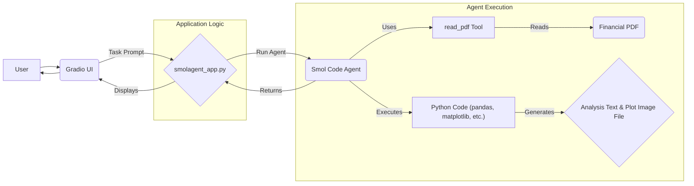

# Financial Analysis Agent using Smol Agents

## Overview

This Python script leverages the `smol-agents` library to create an AI agent capable of analyzing financial data from PDF documents (specifically, Google's 10-K reports in this example). It extracts key financial metrics, performs trend analysis and forecasting, and generates visualizations. The results are presented in a user-friendly web interface built with Gradio. Under the hood, the AI agent is powered by a model deployed on Azure OpenAI (referred to as `gpt-4.1` in the environment configuration for this project).

## How it Helps

This tool automates several tedious steps involved in basic financial statement analysis:

*   **Downloads** required financial reports (PDFs).
*   **Reads and extracts** text data from PDFs.
*   **Identifies and extracts** specific financial figures (e.g., revenue, net profit, cash flow).
*   **Performs calculations** and fits simple forecasting models.
*   **Generates plots** to visualize trends and forecasts.
*   **Summarizes** key findings and assumptions.
*   Provides an **interactive UI** to trigger and view the analysis.

This allows users to quickly get insights from financial documents without manual data entry and plotting.

## Workflow Diagram



## Features

*   **Automated PDF Downloading:** Fetches specified financial reports from URLs.
*   **PDF Text Extraction:** Uses a custom `read_pdf` tool integrated with the agent.
*   **Agent-Based Analysis:** Employs a `CodeAgent` to understand the task, read the PDF, write and execute Python code for analysis and plotting.
*   **Data Extraction:** Pulls specific financial figures (Revenue, Net Profit, Operating Cash Flow).
*   **Trend Visualization:** Generates bar charts comparing historical data.
*   **Simple Forecasting:** Fits a basic growth model and projects future values.
*   **Forecast Visualization:** Overlays forecast trends on the historical chart.
*   **Assumption Listing:** Annotates the analysis with key assumptions.
*   **Web UI:** Uses Gradio to provide an interface for running the agent and viewing results (text analysis and plot image).

## Setup

1.  **Clone the repository or download the script.**
2.  **Install required Python libraries:**
    ```bash
    pip install smol-agents azure-ai-openai python-dotenv requests pypdf2 gradio matplotlib pandas numpy scikit-learn seaborn missingno
    ```
3.  **Create a `.env` file** in the same directory as the script with your Azure OpenAI API credentials:
    ```dotenv
    AZURE_OPENAI_ENDPOINT_41="YOUR_AZURE_ENDPOINT"
    AZURE_OPENAI_API_KEY_41="YOUR_AZURE_API_KEY"
    AZURE_OPENAI_CHAT_DEPLOYMENT_NAME_41="YOUR_DEPLOYMENT_NAME" # e.g., gpt-4
    AZURE_OPENAI_API_VERSION_41="YOUR_API_VERSION"
    ```
    *(Replace placeholders with your actual credentials)*

## Usage

1.  Make sure your `.env` file is correctly set up.
2.  Run the script from your terminal:
    ```bash
    python smolagent_app.py
    ```
3.  The script will download the necessary PDF(s).
4.  A Gradio interface will launch in your web browser (or provide a URL).
5.  Review or modify the default task prompt in the UI.
6.  Click "Submit".
7.  The agent will perform the analysis. This may take a minute or two.
8.  The results (analysis text and plot image) will be displayed in the Gradio UI components.

## Customization

*   **Task Prompt:** The core analysis instructions are defined in the `financial_analyst_task` variable within `smolagent_app.py`. You can modify this prompt directly in the script or in the Gradio UI textbox to change the analysis performed.
*   **PDF Source:** Update the `files` dictionary in the script to point to different PDF URLs or local paths. Remember to adjust the `context` variable and potentially the `read_pdf` calls within the prompt if using different files.
*   **Agent Configuration:** Adjust `max_steps`, `additional_authorized_imports`, or the `model` used by the `CodeAgent` in `smolagent_app.py`. 